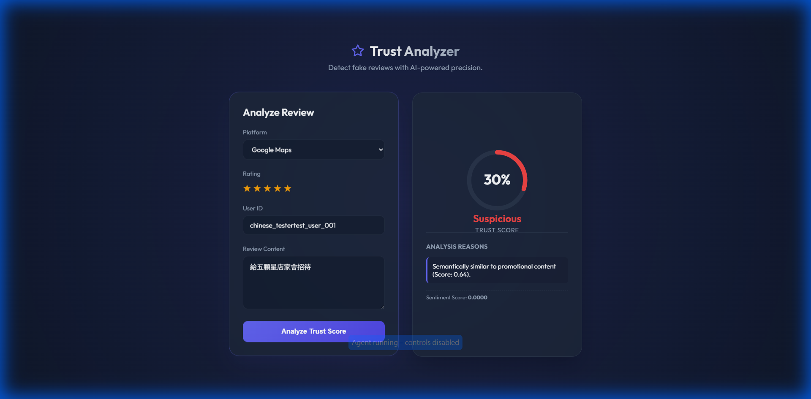
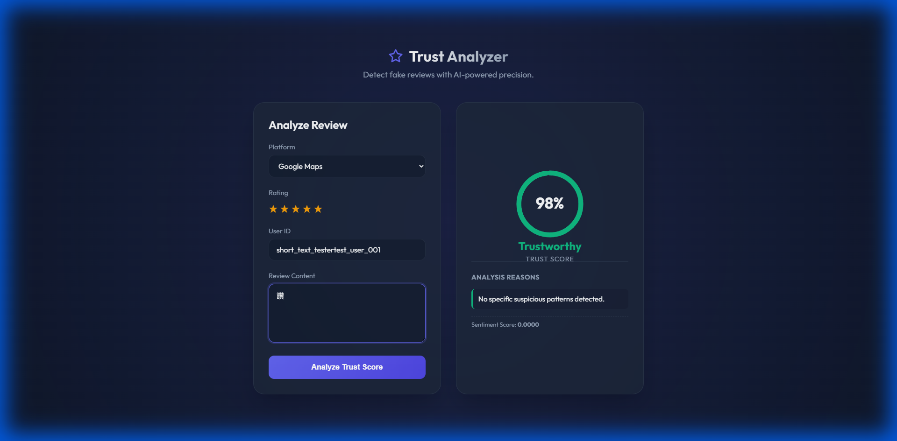
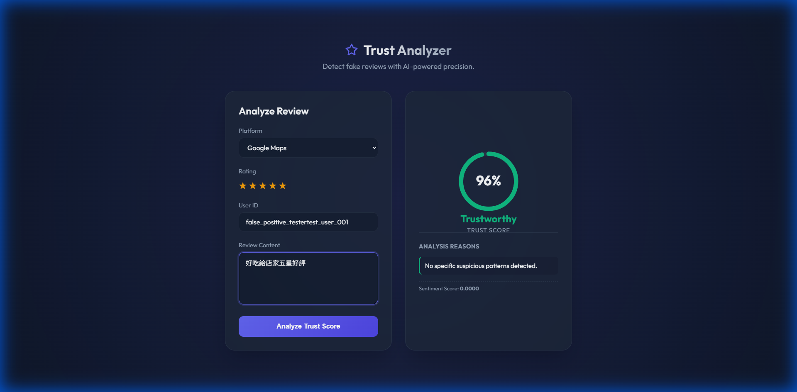
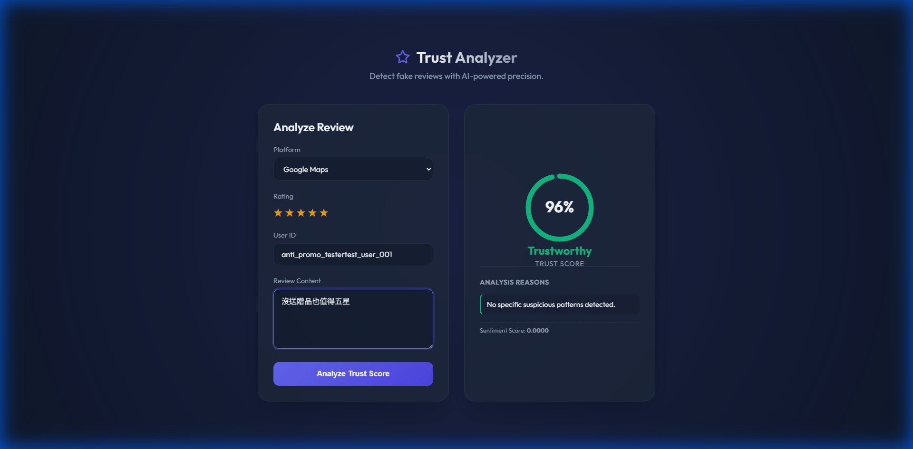

# Test Cases & Validation Results

This document documents the validation of the **Semantic Analysis Module** (v0.2.0), specifically focusing on edge cases, false positives, and multilingual support.

## Case 1: Implicit Promotional Content (Chinese)
**Input:** `"給五顆星店家會招待小菜"`
**Challenge:** No explicit keywords like "免費" (free) or "折扣" (discount).
**Result:** 🔴 **Suspicious**
**Reason:** Correctly identified as semantically similar to promotional seeds.

---

## Case 2: Short Text Protection
**Input:** `"讚"`
**Challenge:** Extremely short text can cause vector instability and false positives.
**Result:** ✅ **Safe**
**Reason:** Short text filter (< 5 chars) successfully prevented semantic analysis misfire.

---

## Case 3: Genuine Positive Review (False Positive Fix)
**Input:** `"好吃給店家五星好評"`
**Challenge:** Contains "五星好評" (5-star review) which is a strong feature in promo spam, but the intent is genuine praise ("好吃").
**Result:** ✅ **Safe**
**Reason:** **Contrastive Analysis** determined it is closer to "Safe Seeds" (genuine praise) than "Promo Seeds".

---

## Case 4: Anti-Promo Statement (Negation Handling)
**Input:** `"沒送贈品也值得五星"`
**Challenge:** Explicitly mentions "贈品" (gift), usually a red flag.
**Result:** ✅ **Safe**
**Reason:** **Safe Seeds** with negation patterns (e.g., "Even without discount...") successfully overrode the promo similarity.

